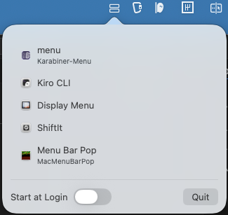

# MacMenuBarPop

[English README](README.md)

MacMenuBarPop は macOS のメニューバー右側にあるアイコンを Accessibility で取得し、
ノッチやオーバーフローで隠れていても操作できるようにする常駐ユーティリティです。



## 主な機能
- メニューバーに常駐するステータスアイコン
- 右側メニューバー項目の一覧表示（サードパーティ優先）
- 一覧クリックでメニューバーアイコンと同等の動作（AXPress）
- Start at Login の切り替えと Quit ボタン

## 動作環境
- macOS 13 以降
- Accessibility 権限

## 権限について
Accessibility API でシステム UI ツリーを参照し、メニューバー項目に対して
AXPress を実行します。未許可の場合は許可方法を表示します。

## ビルドと実行 (SwiftPM)
```sh
swift run
```

## .app 生成
```sh
./scripts/package_app.sh
```
出力先: `build/MacMenuBarPop.app`

## Start at Login 補足
`SMAppService` を利用しています。未署名アプリの場合、登録に失敗することがあります。
必要に応じて署名してください。

## トラブルシューティング
- 一覧が空の場合、Accessibility 権限を確認してください。
- デバッグログが必要な場合は `AX_DEBUG=1 swift run` を使います。
